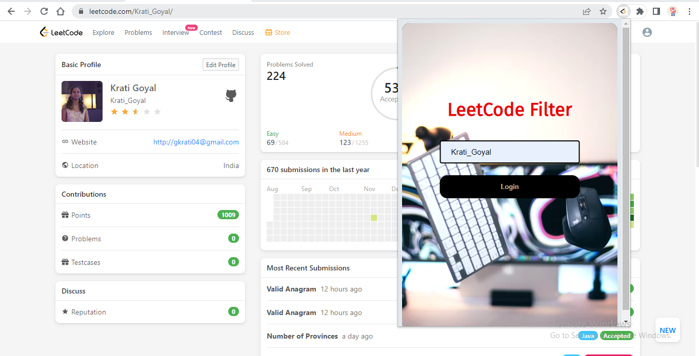
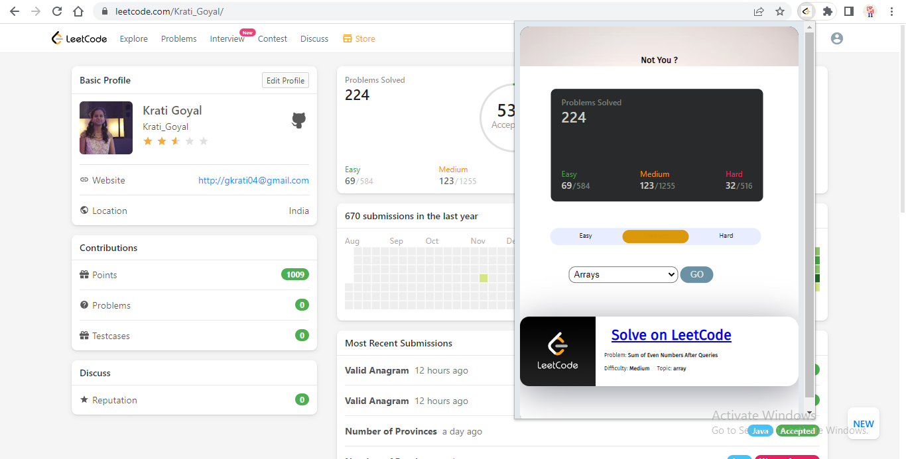

# LeetCode-Filter

Hi👋, I'm Krati Goyal

Motive : To use LeetCode Efficiently

# Find your LeetCode Id

<a href="https://leetcode.com/profile/account/">Click me</a>
 

 

# How to use this

<ul>
  <li> Clone this repository in your system </li>
   
  
      git clone https://github.com/iamkrati/LeetCode-Filter.git
  
  
  <li> Follow these Steps :  
    1. Go to chrome://extensions in your Google Chrome browser  
    2. Check the Developer mode checkbox in the top right-hand corner  
    3. Click “Load Unpacked” to see a file-selection dialog  
    4. Select your extension directory
  </li> 
  <li>
    Enter your LeetCode Id  
     

 

   
  </li> 
  <li>
    Once you enter your LeetCode Id, it will display your stats and select a random question for practise. You can choose questions from different topics(e.g Dynamic Programming, Trees etc) and set the difficulty level of your choice.
      
    
  </li>
 </ul> 
  
 
 # Contact
 
 <a href="https://iamkrati.github.io/Krati-sPortfolio/">Click</a> for Contact me

  
